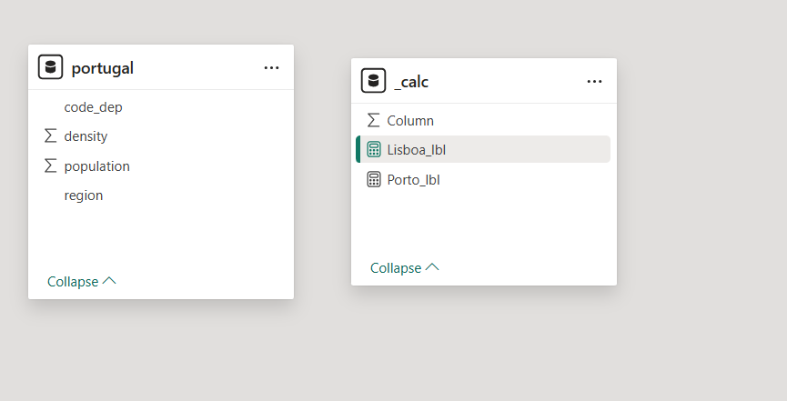
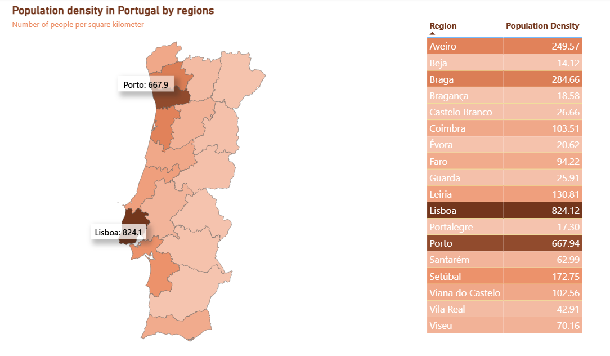

# Portugal Population Density Dashboard

## Project Overview

This project analyzes population density across Portuguese regions and presents the distribution in an interactive Power BI map dashboard.
The report uses a `portugal` dataset with region-level density values and a custom Portugal districts TopoJSON map for geographic visualization.

The objective was to:

- Visualize population density by region in Portugal

- Compare regional density values using a color-scaled map

- Highlight high-density areas such as Lisboa and Porto

- Provide a supporting table for region-level density comparison

## Tools & Technologies

- Power BI Desktop

- Power Query

- DAX

- TopoJSON

## Source Data & Data Model

The analysis is based on one source table:

- `portugal` - region names and population density values

Additional resources and helper tables were used in Power BI:

- `portugal-districts_topojson` - custom map geometry used for the shape map visual

- `_calc` - measure table used to store custom labels for Lisboa and Porto

### Data Model Schema



## Data Preparation

The data preparation and visualization process was performed directly in Power BI. The preparation included:

- Loading region-level population density data into Power BI

- Matching region names with the custom Portugal districts TopoJSON map

- Configuring a shape map visual with a density-based color scale

- Creating custom DAX labels for selected high-density regions

- Building a table view for region-level density comparison

## Dashboard



The dashboard includes:

- **Population Density Map** - shape map showing density by Portuguese region

- **Regional Density Table** - table listing regions and population density values

- **Custom Region Labels** - highlighted labels for Lisboa and Porto

- **Density Color Scale** - gradient scale from lower to higher population density

## Key Insights

- Population density varies significantly across Portuguese regions

- Lisboa and Porto are highlighted as key high-density urban areas

- The color-scaled map helps identify regional concentration patterns at a glance

- The supporting table provides an exact density value for each region

- The dashboard combines geographic context with a compact tabular view for comparison

## How to Run

1. Clone this repository

2. Open the [`.pbix` file](dashboard/portugal.pbix) in Power BI Desktop

3. Review the data model and custom TopoJSON map configuration

4. Explore the map and regional density table

## Project Structure

```text
portugal-population-density-dashboard/
├── docs/
│   └── data_model.png
├── dashboard/
│   └── portugal.pbix
├── screenshots/
│   └── dashboard_preview.png
└── README.md
```
